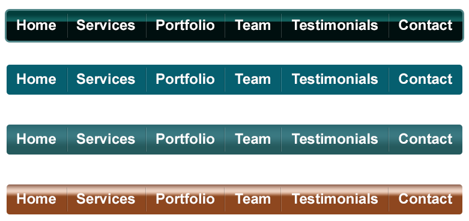
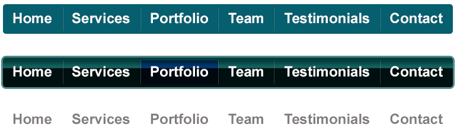
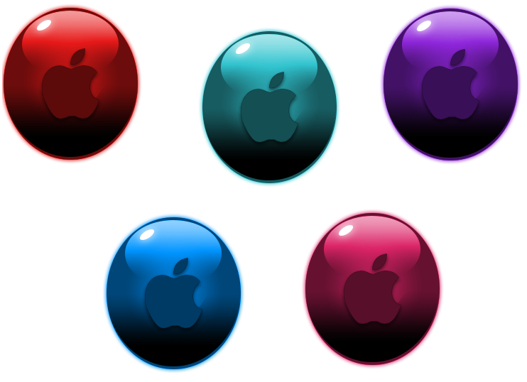
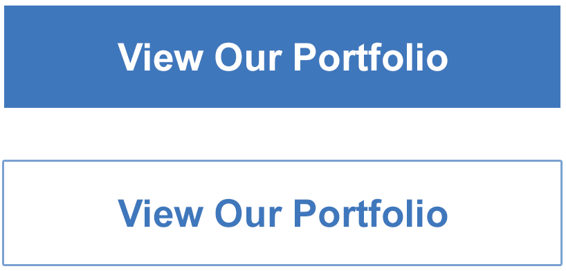

# Photoshop web designing
<!--index-->
<ol>
  <li><h4><a href="#psd1">Simple navbar</a></h4></li>
  <li><h4><a href="#psd2">Gradient navbar</a></h4></li>
  <li><h4><a href="#psd3">Corporate navbar</a></h4></li>
  <li><h4><a href="#psd4">Glossy icon buttons</a></h4></li>
  <li><h4><a href="#psd5">Call to action buttons</a></h4></li>
</ol>
<!--content-->
# Demos
<h3 id="psd1">Simple navbar</h3>

<h3 id="psd2">Simple navbar</h3>

<h3 id="psd3">Corporate navbar</h3>

<h3 id="psd4">Glossy icon buttons</h3>

<h3 id="psd5">Call to action buttons</h3>
